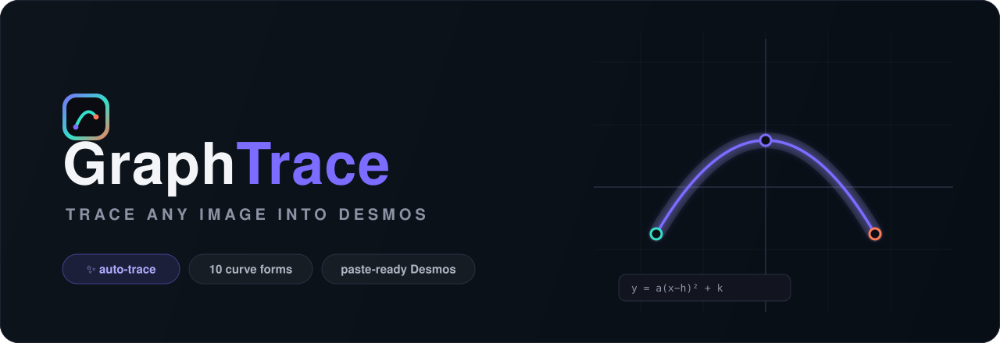
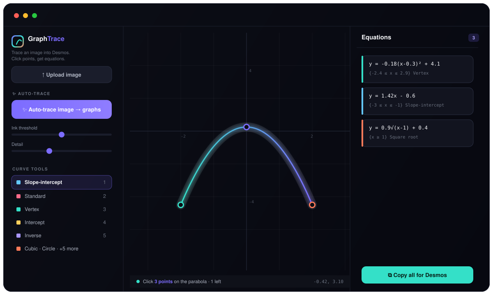

<div align="center">



<br/><br/>

### Turn any image into paste-ready [Desmos](https://www.desmos.com/calculator) equations.

Drop a picture on a coordinate plane and **auto-trace it in one click** — or place points by hand. GraphTrace fits the curves and hands you clean Desmos, complete with domain restrictions so every segment stays bounded.

<br/>

<a href="https://graphtrace.vercel.app/"></a>


<br/><br/>

**[Auto-trace](#-auto-trace--one-click) · [Live demo](#-try-it-now) · [Forms](#-forms--manual-tools) · [Using it](#-using-it) · [Shortcuts](#-shortcuts) · [How the math works](#-how-the-math-works)**

</div>

<br/>



<br/>

> **Upload → position → ✨ Auto-trace → Copy all for Desmos.**
> Paste the block into Desmos and every stroke becomes its own expression, domain-restricted and ready.

No install. No dependencies. No build step. **One HTML file** that reads pixels and writes math.

<br/>

## ✨ Auto-trace — one click

Hit **✨ Auto-trace** and GraphTrace reads the image itself. The pipeline:

```
threshold the ink  →  skeletonize to 1px centerlines (Zhang–Suen)
   →  trace each stroke as an ordered path  →  simplify (Ramer–Douglas–Peucker)
      →  split at turning points into function-of-x pieces
         →  least-squares fit each piece as line · parabola · cubic
```

Round closed loops are recognised as **circles / ellipses**; near-vertical strokes become `x = c` lines. Because it follows the actual strokes (not columns), it handles multi-stroke drawings, curves that double back, and closed shapes.

<table>
<tr>
<td width="33%" valign="top"><b>🖊️ Ink threshold</b><br/><sub>what counts as ink</sub></td>
<td width="33%" valign="top"><b>🎚️ Detail</b><br/><sub>faithful vs. smooth</sub></td>
<td width="33%" valign="top"><b>🌑 Invert</b><br/><sub>for chalk-on-dark images</sub></td>
</tr>
</table>

> [!TIP]
> Position the image where you want it **first**, then trace.

<br/>

## 🧰 Forms — manual tools

Prefer precision? Pick a form and click the points it asks for. Fitted curves draw live and land in the panel.

| Tool | Equation | Clicks |
|:--|:--|:--|
| **Slope-intercept** | `y = mx + b` | 2 points on the line |
| **Standard** *(parabola)* | `y = ax² + bx + c` | 3 points on the parabola |
| **Vertex** *(parabola)* | `y = a(x−h)² + k` | vertex, then 1 point |
| **Intercept** *(parabola)* | `y = a(x−p)(x−q)` | 2 x-intercepts, then a point |
| **Inverse** | `y = a/(x−h) + k` | 3 points on one branch |
| **Cubic** | `y = ax³ + bx² + cx + d` | 4 points along the curve |
| **Absolute value** | `y = a\|x−h\| + k` | corner, then a point on an arm |
| **Square root** | `y = a√(x−h) + k` | start, then a point to the right |
| **Circle** | `(x−h)² + (y−k)² = r²` | center, then a point on the edge |
| **Ellipse** | `(x−h)²/a² + (y−k)²/b² = 1` | center, then a corner |

<br/>

## ✦ Try it now

<div align="center">

### ▶ **[graphtrace.vercel.app](https://graphtrace.vercel.app/)**

Upload a doodle · hit Auto-trace · copy the equations into Desmos.

</div>

<br/>

## 🚀 Using it

1. **Open** `index.html` in a browser — or serve it:
   ```bash
   git clone https://github.com/yunseongkim1009/graphtrace.git
   cd graphtrace
   python3 -m http.server 5370
   ```
2. **Upload / drag / paste** an image. Adjust opacity and size; use **Move image** to reposition.
3. **Auto-trace**, or pick a form and click the points it asks for.
4. **Copy** one equation, or **Copy all for Desmos** — paste the block and each line becomes its own expression.

<br/>

## ⌨️ Shortcuts

| Key | Action | | Key | Action |
|:--:|:--|:--:|:--:|:--|
| `1`–`0` | select tools | | `U` | undo |
| `V` | pan | | `Esc` | cancel |
| `M` | move image | | 🖱️ wheel | zoom |
| right-drag | pan | | | |

<br/>

## 🧠 How the math works

<details>
<summary><b>Why one equation at a time?</b></summary>

<br/>

The function forms all pass the vertical-line test, so they trace outlines, arcs, and swooshes **one equation at a time** — build a closed shape from several segments. Circles and ellipses are the closed implicit forms, plotted whole.

Domain restrictions are exported as Desmos LaTeX (`\left\{…\right\}`) so each segment pastes correctly and stays bounded.

</details>

<br/>

## ✦ Tech


- **One `index.html`** — UI, image pipeline, curve fitting and Desmos export in a single file
- **Vanilla JavaScript** — no framework, no bundler, no `node_modules`
- **`<canvas>`** for thresholding, Zhang–Suen thinning, RDP simplification and least-squares fits
- Drop it on any static host and it's live

<br/>

<div align="center">

**From pixels to math in one click.** ✨

<sub>Built with a single HTML file · no frameworks harmed in the making</sub>

</div>
